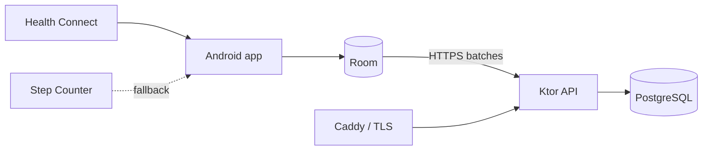

# StepsTracker

[](https://kotlinlang.org/)
[](https://developer.android.com/)
[](https://www.postgresql.org/)
[](LICENSE)

StepsTracker is an open-source, self-hosted platform for collecting, synchronizing, and analyzing steps recorded by an Android phone. Your data remains under your control in a PostgreSQL database running on your own infrastructure.

## Features

- Collection through Health Connect, with `TYPE_STEP_COUNTER` as an exclusive fallback.
- Offline Room cache and idempotent synchronization through WorkManager.
- Registration and login with JWTs, rotating refresh tokens, and Argon2id password hashing.
- Steps aggregated into 15-minute UTC intervals.
- Daily statistics, trends, and time-of-day distribution.
- Time-aware weight history so profile changes never rewrite past calorie estimates.
- Personalized distance and calorie estimates based on physical profile data.
- A home-screen widget showing today’s synchronized steps.
- Automatic light/dark appearance following the Android system theme.
- Runtime server URL selection, including optional reverse-proxy path prefixes.
- VPS deployment with Docker Compose, PostgreSQL, and automatic HTTPS through Caddy.
- Complete deletion of an account and all associated data.

> [!NOTE]
> Distance and calories are approximate values, not medical measurements. The sensor fallback collects while the app is active; Health Connect is the intended path for historical and background collection.

## Architecture



| Component | Technologies | Responsibility |
| --- | --- | --- |
| Android app | Kotlin, Compose, Room, WorkManager | Collection, offline cache, synchronization, and UI |
| API | Kotlin, Ktor, Flyway | Authentication, validation, aggregation, and statistics |
| Database | PostgreSQL 17 | Users, profiles, devices, tokens, and intervals |
| Infrastructure | Docker Compose, Caddy | Persistence, health checks, and TLS termination |

## Requirements

- Docker with Docker Compose v2.
- [`just`](https://github.com/casey/just) for convenient commands.
- Android Studio, or Android SDK 36 and Java 17, to build the app.
- For production: a Linux VPS, a DNS domain, and reachable ports 80/443.

## Quick start

```bash
git clone <REPOSITORY_URL>
cd StepsTracker
just init
```

Edit `.env` and provide random passwords and a `JWT_SECRET` containing at least 32 characters, then start the backend:

```bash
just dev
just health
```

The local API is available at `http://localhost:8080`. List every available command with:

```bash
just
```

Fresh databases include a demonstration account with data covering the current day back through the previous two months:

```text
Email: demo@example.com
Password: demo
```

Set `SEED_DEMO_USER=false` in production to disable demo-account creation.

### Testing from a phone on the local network

On a trusted Wi-Fi network, expose the development API to the LAN and install a debug build configured with the computer's local address:

```bash
just lan-up
just android-install-lan
```

The debug manifest permits local HTTP traffic; release builds remain HTTPS-only. Allow the configured API port through the computer firewall if required. Never expose this development endpoint directly to the public internet.

## Android app

Set the public API URL in `android/gradle.properties`:

```properties
API_BASE_URL=https://steps.example.com/
```

The URL must end with `/`. Open `android/` in Android Studio or build it from the terminal:

```bash
just android-build
```

Health Connect is built into Android 14 and later. Earlier compatible devices may require the Health Connect app to be installed.

## VPS deployment

Set the domain pointing to your VPS in `.env`, then start the production profile:

```bash
just prod-up
just prod-status
```

Caddy automatically obtains and renews the TLS certificate. PostgreSQL is not exposed to the public network, and direct API access is bound to localhost.

Before updating:

```bash
just backup
git pull --ff-only
just prod-up
```

See the [deployment guide](docs/deployment.md) and [backup and restore guide](docs/backup.md) for complete procedures.

## Development and testing

```bash
just test              # Backend and Android
just backend-test      # Backend JVM tests
just android-test      # Android unit tests
just compose-validate  # Validate the Compose configuration
just logs              # Follow combined local logs
```

The REST specification is available at [docs/openapi.yaml](docs/openapi.yaml). Dates exchanged with the server use ISO-8601, and intervals are persisted in UTC.

## Repository structure

```text
.
├── android/     Native Android app
├── backend/     Ktor API and Flyway migrations
├── docs/        Architecture, API, privacy, and operations
├── infra/       Docker Compose and Caddy configuration
├── justfile     Development and deployment commands
└── LICENSE      MIT license
```

## Security and privacy

Never commit `.env`, database dumps, or credentials. Use HTTPS exclusively in production, keep encrypted backups outside the VPS, and test restoration regularly. See [docs/privacy.md](docs/privacy.md) for details.

To report a vulnerability, do not create a public issue containing exploitable details or personal data. Contact the repository maintainer privately instead.

## Contributing

Issues and pull requests are welcome. Before proposing a change:

1. Keep Android collection, synchronization, and server logic separated.
2. Add tests for modified behavior.
3. Run `just test` and `just compose-validate`.
4. Do not include real health data in fixtures or logs.

## License

Distributed under the [MIT License](LICENSE).
