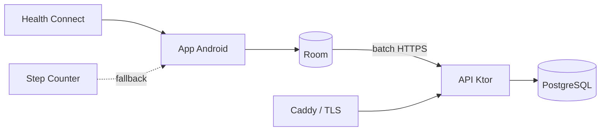

# StepsTracker

[](https://kotlinlang.org/)
[](https://developer.android.com/)
[](https://www.postgresql.org/)
[](LICENSE)

StepsTracker è una piattaforma open source e self-hosted per raccogliere, sincronizzare e analizzare i passi registrati da un telefono Android. I dati rimangono sotto il tuo controllo, su un database PostgreSQL eseguito nella tua infrastruttura.

## Funzionalità

- Raccolta tramite Health Connect, con sensore `TYPE_STEP_COUNTER` come fallback esclusivo.
- Cache offline con Room e sincronizzazione idempotente tramite WorkManager.
- Registrazione e login con JWT, refresh token ruotabili e password Argon2id.
- Passi aggregati in intervalli UTC di 15 minuti.
- Statistiche giornaliere, trend e distribuzione per momento della giornata.
- Stima personalizzata di distanza e kcal a partire dal profilo fisico.
- Deployment su VPS con Docker Compose, PostgreSQL e HTTPS automatico tramite Caddy.
- Cancellazione completa dell'account e dei dati associati.

> [!NOTE]
> Distanza e kcal sono valori approssimativi, non misurazioni mediche. Il fallback sensore raccoglie mentre l'app è attiva; Health Connect è il percorso previsto per la raccolta storica e in background.

## Architettura



| Componente | Tecnologie | Responsabilità |
| --- | --- | --- |
| App Android | Kotlin, Compose, Room, WorkManager | Raccolta, cache offline, sincronizzazione e UI |
| API | Kotlin, Ktor, Flyway | Autenticazione, validazione, aggregazioni e statistiche |
| Database | PostgreSQL 17 | Utenti, profili, dispositivi, token e intervalli |
| Infrastruttura | Docker Compose, Caddy | Persistenza, health check e terminazione TLS |

## Requisiti

- Docker con Docker Compose v2.
- [`just`](https://github.com/casey/just) per i comandi abbreviati.
- Android Studio oppure Android SDK 36 e Java 17 per compilare l'app.
- Per la produzione: VPS Linux, dominio DNS e porte 80/443 raggiungibili.

## Avvio rapido

```bash
git clone <URL_DEL_REPOSITORY>
cd StepsTracker
just init
```

Modifica `.env`, usando password casuali e un `JWT_SECRET` di almeno 32 caratteri, quindi avvia il backend:

```bash
just dev
just health
```

L'API locale risponde su `http://localhost:8080`. Visualizza tutti i comandi disponibili con:

```bash
just
```

## App Android

Imposta l'URL pubblico dell'API in `android/gradle.properties`:

```properties
API_BASE_URL=https://steps.example.com/
```

L'URL deve terminare con `/`. Puoi quindi aprire `android/` in Android Studio oppure compilare da terminale:

```bash
just android-build
```

Su Android 14 e versioni successive Health Connect è integrato nel sistema. Sui dispositivi compatibili precedenti può essere necessario installare l'app Health Connect.

## Deployment su VPS

Configura nel `.env` il dominio che punta alla VPS e avvia il profilo di produzione:

```bash
just prod-up
just prod-status
```

Caddy richiede e rinnova automaticamente il certificato TLS. PostgreSQL non viene pubblicato sulla rete esterna e l'API diretta è vincolata a localhost.

Prima di ogni aggiornamento:

```bash
just backup
git pull --ff-only
just prod-up
```

Consulta [deployment](docs/deployment.md) e [backup/ripristino](docs/backup.md) per la procedura completa.

## Sviluppo e test

```bash
just test              # backend e Android
just backend-test      # test JVM del backend
just android-test      # test unitari Android
just compose-validate  # validazione Docker Compose
just logs              # log locali aggregati
```

La specifica REST è disponibile in [docs/openapi.yaml](docs/openapi.yaml). Le date scambiate con il server sono ISO-8601 e gli intervalli vengono persistiti in UTC.

## Struttura del repository

```text
.
├── android/     App Android nativa
├── backend/     API Ktor e migrazioni Flyway
├── docs/        Architettura, API, privacy e operazioni
├── infra/       Docker Compose e configurazione Caddy
├── justfile     Comandi di sviluppo e deployment
└── LICENSE      Licenza MIT
```

## Sicurezza e privacy

Non committare mai `.env`, dump del database o credenziali. In produzione usa esclusivamente HTTPS, conserva backup cifrati fuori dalla VPS e prova periodicamente il ripristino. Ulteriori dettagli sono disponibili in [docs/privacy.md](docs/privacy.md).

Per segnalare una vulnerabilità, evita issue pubbliche contenenti dettagli sfruttabili o dati personali e contatta privatamente il maintainer del repository.

## Contribuire

Issue e pull request sono benvenute. Prima di proporre una modifica:

1. Mantieni separati raccolta Android, sincronizzazione e logica server.
2. Aggiungi test per i comportamenti modificati.
3. Esegui `just test` e `just compose-validate`.
4. Non includere dati sanitari reali nei fixture o nei log.

## Licenza

Distribuito con licenza [MIT](LICENSE).

