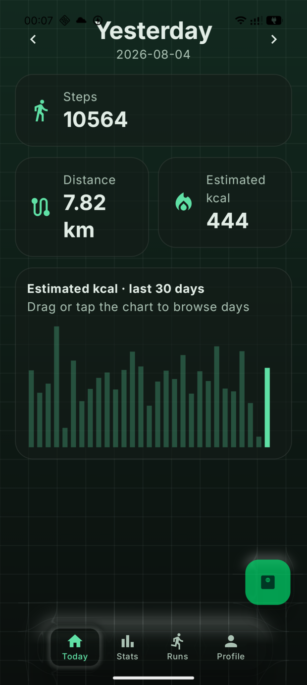
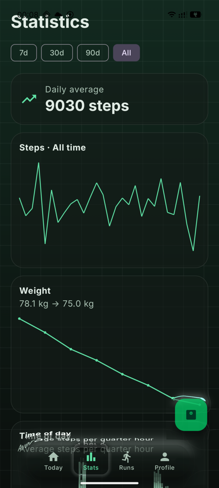
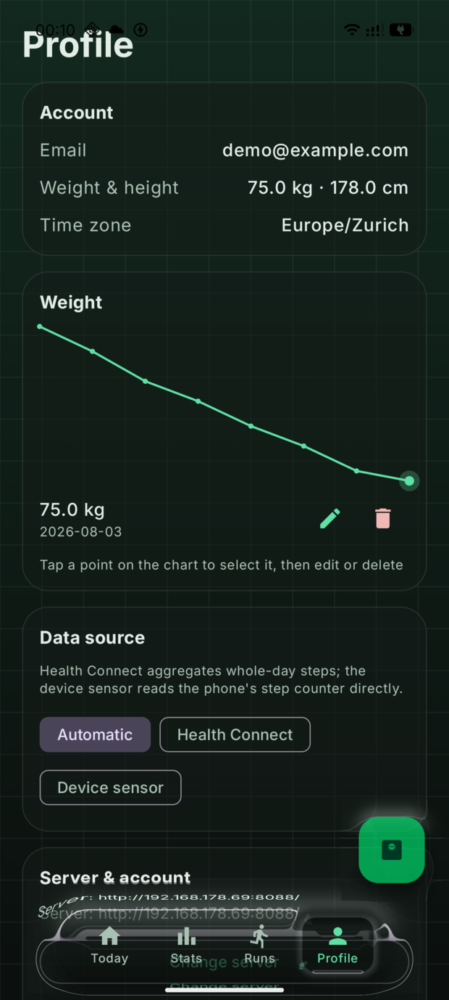
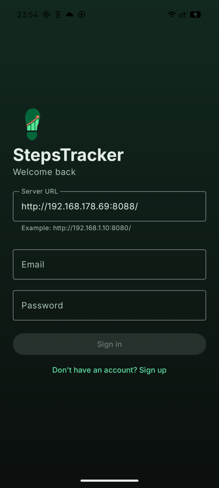
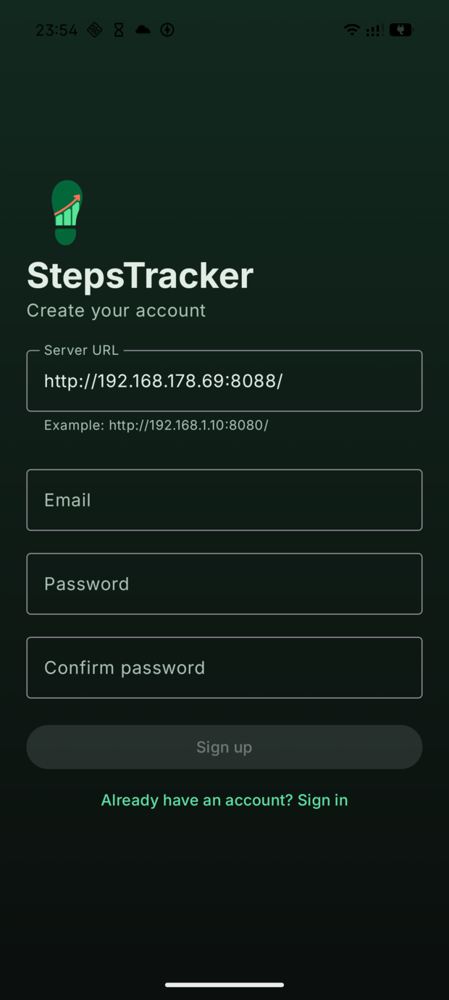
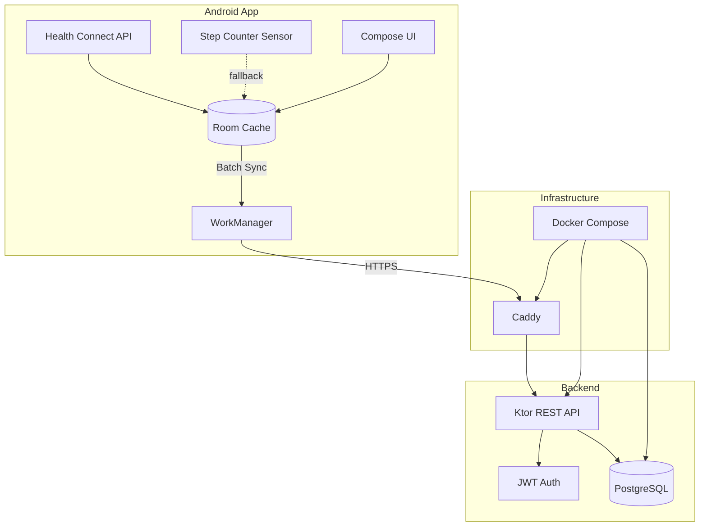

# StepsTracker

[](https://kotlinlang.org/)
[](https://developer.android.com/)
[](https://www.postgresql.org/)
[](LICENSE)

**StepsTracker** is an open-source, self-hosted platform to collect, sync, and analyze the steps recorded by an Android phone. Your data stays under your control in a PostgreSQL database on your own infrastructure.

## 🎯 Demo Account

Try the app with the preconfigured demo account:

```
Email: demo@example.com
Password: demopassword123
```

> The demo account includes the last 2 months of data for a full demonstration of the features.

## 📱 Screenshots

### Dashboard and Statistics

*Main dashboard with daily step count and trend charts*


*Detailed statistics view with time-of-day distribution*

### Profile and Settings

*User profile management with physical data for personalized calorie estimation*


*Server configuration and sync preferences*

### Widget and Notifications

*Home screen widget for quick monitoring of synced steps*

### Authentication

*Login screen with support for custom servers*


*New account registration*

## 🚀 Key Features

### 📊 Data Collection and Analysis
- **Health Connect Integration**: Automatic step collection through the Health Connect API
- **Sensor Fallback**: Uses `TYPE_STEP_COUNTER` when Health Connect is unavailable
- **15-Minute Intervals**: Data aggregation into UTC intervals for detailed analysis
- **Complete Statistics**: Daily view, weekly trends, and time-of-day distribution

### 🔐 Security and Privacy
- **Self-Hosted**: Full control of your data on your own server
- **JWT Authentication**: Secure tokens with automatic refresh
- **Argon2id**: Password hashing with a state-of-the-art algorithm
- **HTTPS Only**: Encrypted communication in production

### 💪 Advanced Features
- **Offline Sync**: Local cache with Room and automatic sync via WorkManager
- **Personalized Calorie Calculation**: Estimates based on the physical profile with weight history
- **Home Screen Widget**: Quick view of the day's steps
- **Day Navigation**: Browse previous days with per-day calorie estimates
- **Dark Mode**: Automatic theme following the system settings
- **Multi-Server**: Support for custom server URLs and reverse proxies

## 🏗️ Architecture



## 📋 System Requirements

### For Development
- **Docker** with Docker Compose v2
- **[just](https://github.com/casey/just)** for development commands
- **Android Studio** or Android SDK 36 + Java 17
- **Git** for version control

### For Production
- **Linux VPS** (Ubuntu/Debian recommended)
- **DNS domain** pointed at the server
- **Ports 80/443** publicly accessible
- **2GB RAM** minimum recommended

## 🛠️ Quick Installation

### 1. Clone and Initial Setup

```bash
git clone <REPOSITORY_URL>
cd StepsTracker
just init
```

### 2. Environment Configuration

Edit `.env` with secure passwords and a `JWT_SECRET` of at least 32 characters:

```env
DB_PASSWORD=your_secure_password_here
JWT_SECRET=your_very_long_secret_key_minimum_32_chars
DOMAIN=steps.example.com
```

### 3. Start the Development Backend

```bash
just dev
just health
```

The local API will be available at `http://localhost:8080`

### 4. Build and Install the Android App

Configure the API URL in `android/gradle.properties`:

```properties
API_BASE_URL=https://steps.example.com/
```

Then build the app:

```bash
just android-build
# or open android/ in Android Studio
```

## 🌐 Production Deployment

### VPS Setup

```bash
# On your VPS
git clone <REPOSITORY_URL>
cd StepsTracker
just init

# Configure .env with the real domain
nano .env

# Start production services
just prod-up
just prod-status
```

Caddy will automatically obtain TLS certificates from Let's Encrypt.

### Updates

```bash
just backup              # ALWAYS back up first!
git pull --ff-only
just prod-up
```

## 🧪 Testing

```bash
just test                # All tests
just backend-test        # Backend only
just android-test        # Android only
just compose-validate    # Validate Docker configuration
```

## 📁 Repository Structure

```
StepsTracker/
├── android/            # Native Android app (Kotlin/Compose)
│   ├── app/           # Application code
│   └── gradle/        # Build configuration
├── backend/           # REST API (Kotlin/Ktor)
│   ├── src/          # Source code
│   └── migrations/   # Flyway database migrations
├── docs/             # Detailed documentation
│   ├── architecture.md
│   ├── deployment.md
│   ├── backup.md
│   ├── privacy.md
│   ├── openapi.yaml
│   └── screenshots/  # App screenshots (to be added)
├── infra/           # Infrastructure configuration
│   ├── compose.yaml # Docker Compose
│   └── Caddyfile    # Reverse proxy config
├── justfile         # Automation commands
├── .env.example     # Configuration template
└── LICENSE          # MIT License
```

## 🔧 Useful Commands

| Command | Description |
|---------|-------------|
| `just` | Show all available commands |
| `just dev` | Start the backend in development mode |
| `just dev-down` | Stop development services |
| `just logs` | Show real-time logs |
| `just backup` | Create a database backup |
| `just restore <file>` | Restore a backup |
| `just android-install-lan` | Install the app for LAN testing |
| `just prod-up` | Production deployment |
| `just prod-status` | Production services status |

## 🔒 Security and Privacy

### Best Practices
- **Never commit** `.env`, database dumps, or credentials
- **Always use HTTPS** in production
- **Encrypted backups** stored off the VPS
- **Regular restore tests**
- **Frequent dependency updates**

### Vulnerability Reporting
To report vulnerabilities, **do not open public issues**. Contact the repository maintainer privately.

See [docs/privacy.md](docs/privacy.md) for full details on data handling.

## 🤝 Contributing

Contributions are welcome! Before proposing changes:

1. **Keep separation**: Android logic, sync, and server must stay modular
2. **Add tests**: every change must have appropriate tests
3. **Validate everything**: run `just test` and `just compose-validate`
4. **Privacy first**: never include real health data in fixtures or logs

### Development Workflow

```bash
# 1. Fork and clone
git clone https://github.com/YOUR_USERNAME/StepsTracker
cd StepsTracker

# 2. Create a feature branch
git checkout -b feature/amazing-feature

# 3. Develop and test
just dev
just test

# 4. Commit and push
git add .
git commit -m "Add amazing feature"
git push origin feature/amazing-feature

# 5. Open a Pull Request
```

## 📄 License

Distributed under the [MIT License](LICENSE). See `LICENSE` for more information.

## 🙏 Acknowledgments

- Health Connect for the fitness data API
- Ktor for the excellent backend framework
- Jetpack Compose for the modern UI
- The open source community for continued support

---

<p align="center">
  Made with ❤️ for privacy and control over your own data
</p>
