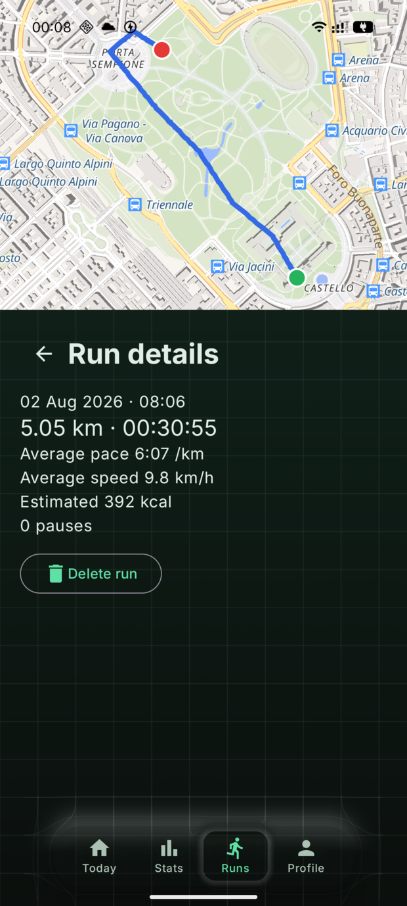
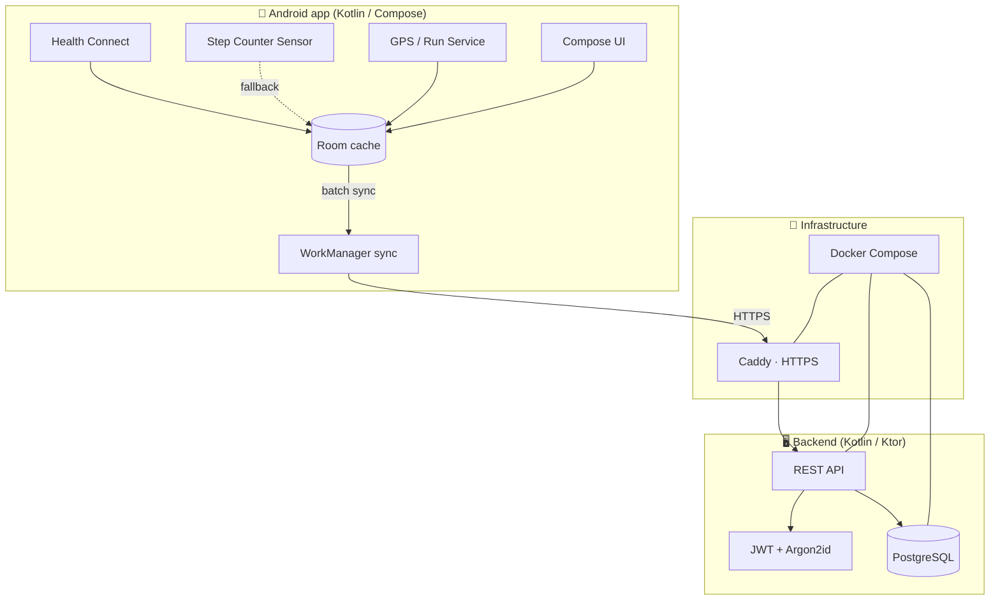

<div align="center">

# StepsTracker

**Self-hosted step, run & weight tracking — your health data on your own server.**

[](https://kotlinlang.org/)
[](https://developer.android.com/)
[](https://ktor.io/)
[](https://www.postgresql.org/)
[](LICENSE)

StepsTracker collects the steps, runs and body-weight recorded on an Android phone,
syncs them to a backend **you** host, and stores everything in a PostgreSQL database
you control. No third-party cloud, no data brokers — just your numbers on your machine.

</div>

---

## ✨ Highlights

- 👟 **Automatic step tracking** via Health Connect, with a raw step-counter sensor fallback.
- 🏃 **GPS run tracking** with a live map, pace/speed/distance and background recording (screen off).
- ⚖️ **Weight history** with trend charts and personalized calorie estimation.
- 📊 **Rich statistics** — daily average, all-time trend, and time-of-day distribution.
- 🧩 **Home-screen widget** for a glance at today's steps.
- 🔌 **Offline-first sync** — a local cache keeps working with no connection and reconciles later.
- 🔐 **Self-hosted & private** — JWT auth, Argon2id password hashing, HTTPS in production.

## 🎯 Demo account

The pre-seeded demo account ships with **three months of sample data**, including weight
history and a recorded run, so you can explore every screen immediately:

```
Email:    demo@example.com
Password: demopassword123
```

## 📱 Screenshots

<table>
  <tr>
    <td align="center"><br/><sub><b>Daily dashboard</b> — steps, distance & calories</sub></td>
    <td align="center"><br/><sub><b>Statistics</b> — trends & weight history</sub></td>
    <td align="center"><br/><sub><b>Run tracking</b> — GPS route & pace</sub></td>
  </tr>
  <tr>
    <td align="center"><br/><sub><b>Profile</b> — account, weight & data source</sub></td>
    <td align="center"><br/><sub><b>Login</b> — connect to your own server</sub></td>
    <td align="center"><br/><sub><b>Registration</b> — create an account</sub></td>
  </tr>
</table>

<div align="center">
  <br/>
  <sub><b>Home-screen widget</b> — today's steps at a glance</sub>
</div>

## 🚀 Features in detail

### 📊 Steps & statistics
- **Health Connect integration** aggregates whole-day steps from any compatible source.
- **Sensor fallback** reads the on-device `TYPE_STEP_COUNTER` when Health Connect is unavailable.
- **15-minute intervals** stored in aligned UTC buckets for precise time-of-day analysis.
- **Day navigation** to browse previous days with per-day distance and calorie estimates.

### 🏃 Run tracking
- **Live GPS map** with route polyline, distance, elapsed time, current/average pace and speed.
- **Background recording** via a foreground service — tracking continues with the screen off.
- **Pause & resume**, then finish to sync the remaining GPS points automatically.
- **Run history** with a per-run detail map, stats and calorie estimate.

### ⚖️ Weight & calories
- **Weight history** with an editable trend chart (add, edit or delete any point).
- **Personalized calories** derived from the physical profile (weight, height) and activity.

### 🔐 Privacy & sync
- **Self-hosted**: every byte lives on infrastructure you own.
- **Offline-first**: a Room cache buffers data and syncs via WorkManager when back online.
- **Secure by default**: JWT access/refresh tokens, Argon2id hashing, server-side rate limiting.
- **Multi-server**: point the app at any server URL or reverse proxy.

## 🏗️ Architecture



## 🧰 Tech stack

| Layer | Technology |
|-------|-----------|
| **Android** | Kotlin, Jetpack Compose, Health Connect, Room, WorkManager, Foreground Service (GPS) |
| **Backend** | Kotlin, Ktor 3, JWT auth, Argon2id, rate limiting |
| **Database** | PostgreSQL 17, Flyway migrations |
| **Infra** | Docker Compose, Caddy (automatic HTTPS) |
| **Tooling** | [`just`](https://github.com/casey/just) task runner, Gradle |

## 📋 Requirements

**Development**
- Docker with Docker Compose v2
- [`just`](https://github.com/casey/just) ≥ 1.52
- Android SDK 36 + JDK 17 (for building the app; the backend builds inside Docker)

**Production**
- A Linux VPS with a domain pointed at it and ports 80/443 reachable
- 2 GB RAM recommended

## ⚡ Quick start

### 1. Clone & configure

```bash
git clone <REPOSITORY_URL>
cd StepsTracker
just setup          # creates .env, checks tools, validates the compose file
```

Edit `.env` and set strong secrets before anything else:

```env
POSTGRES_PASSWORD=change-me
JWT_SECRET=at-least-32-random-characters
DOMAIN=steps.example.com
API_PORT=8088
```

### 2. Start the backend + database

```bash
just run            # docker compose up (API + PostgreSQL), waits until healthy
just stack api-health
```

### 3. Build & install the Android app

Install a debug build pointed at this computer's LAN API (IP auto-detected):

```bash
just mobile install-lan
```

Or build the APK / open `android/` in Android Studio:

```bash
just mobile build   # android/app/build/outputs/apk/debug/app-debug.apk
```

Then launch the app, keep the pre-filled server URL (or set your own) and sign in with
the [demo account](#-demo-account).

## 🌐 Production deployment

```bash
# On your VPS
git clone <REPOSITORY_URL> && cd StepsTracker
just setup
nano .env                 # real domain + secrets, API_HOST=127.0.0.1 behind Caddy

just stack prod-up        # Caddy + API + PostgreSQL with automatic TLS
just stack prod-status
```

Caddy obtains and renews Let's Encrypt certificates automatically.

**Updating**

```bash
just db backup            # always back up first
git pull --ff-only
just stack prod-up
```

## 🧪 Testing

```bash
just tests all            # backend + Android
just tests backend        # backend JVM tests (Gradle container)
just tests android        # Android JVM unit tests
just check                # config + tooling + compose validation
just ci                   # check + full test suite
```

## 🛠️ Task runner

Commands are organized into modules — run `just` (or `just --list`) to see them all.

| Command | Description |
|---------|-------------|
| `just run` | Start the local stack (API + PostgreSQL) |
| `just stack lan-up` | Start the stack bound to the LAN for phone testing |
| `just stack down` | Stop the stack (database volume preserved) |
| `just stack logs [SVC]` | Follow logs (optionally for one service) |
| `just mobile install-lan` | Install a debug APK pointed at the LAN API |
| `just mobile test` | Run Android unit tests |
| `just db backup` / `just db restore FILE` | Back up / restore PostgreSQL |
| `just db reset` | Drop containers and the data volume (destructive) |
| `just stack prod-up` / `just stack prod-down` | Production stack (Caddy + HTTPS) |
| `just doctor` | Full environment diagnostics |

## 📁 Repository structure

```
StepsTracker/
├── android/            # Android app (Kotlin / Compose)
│   └── app/src/        # UI, tracking (steps + runs), data, widget
├── backend/            # REST API (Kotlin / Ktor)
│   └── src/main/       # routes, repositories, Flyway migrations (V1–V4)
├── infra/              # Docker Compose + Caddyfile
├── docs/               # Documentation & screenshots
├── .just/              # just task runner (modules, scripts, manifests)
├── Justfile            # Task-runner entry point
├── .env.example        # Configuration template
└── LICENSE             # MIT
```

## 🔒 Security & privacy

- **Never commit** `.env`, database dumps or credentials — they are git-ignored by default.
- **Always use HTTPS** in production (Caddy handles it) and keep `API_HOST=127.0.0.1` behind it.
- **Back up** regularly with `just db backup` and store dumps off the VPS.
- **Report vulnerabilities privately** — do not open public issues for security matters.

See [docs/privacy.md](docs/privacy.md) for full details on data handling.

## 🤝 Contributing

Contributions are welcome. Before opening a pull request:

1. **Keep concerns modular** — Android, sync and server stay independent.
2. **Add tests** for every change and run `just ci`.
3. **Privacy first** — never include real health data in fixtures, tests or logs.

```bash
git checkout -b feature/amazing-feature
just run && just ci
git commit -m "Add amazing feature" && git push origin feature/amazing-feature
```

## 📄 License

Distributed under the [MIT License](LICENSE).

<div align="center">
  <sub>Built for privacy and control over your own health data.</sub>
</div>
